# 🔧 ネコノテ - Technical Architecture Documentation

## 🎯 System Overview

**ネコノテ** (Cat's Paw) is a sophisticated AI-powered browser automation Chrome extension that uses a multi-agent architecture to intelligently navigate websites, perform complex tasks, and interact with web content. The system combines planning, execution, and validation agents with multimodal AI capabilities to create a powerful automation platform.

---

## 🏗️ Multi-Agent Architecture Deep Dive

### **Core Agent System**

The nanobrowser operates using three specialized AI agents that work together in a coordinated workflow:

```mermaid
graph TB
    User[👤 User Input] --> Planner[🧠 Planner Agent]
    Planner --> Navigator[🚀 Navigator Agent]
    Navigator --> Validator[✅ Validator Agent]
    Validator --> |Success| Complete[✅ Task Complete]
    Validator --> |Failure| Planner
    
    subgraph "Agent Capabilities"
        Planner --> |Creates Strategy| Plan[📋 Step-by-step Plan]
        Navigator --> |Executes Actions| Actions[🎯 Web Actions]
        Validator --> |Checks Results| Validation[🔍 Result Validation]
    end
    
    subgraph "Multimodal Input"
        Vision[👁️ Vision/Screenshots]
        DOM[🌐 DOM Analysis]
        Speech[🎤 Speech-to-Text]
    end
    
    Vision --> Navigator
    DOM --> Navigator
    Speech --> Planner
```



### **1. Planner Agent (Strategic Intelligence)**

**Role**: High-level task decomposition and strategy formulation

**System Prompt Structure**:
```typescript
const plannerPrompt = `
You are an expert web automation planner. Your role is to:

1. ANALYZE the user's request and break it down into logical steps
2. CONSIDER the current webpage context and available actions
3. CREATE a detailed, sequential plan that can be executed by the Navigator
4. ADAPT the plan based on validation feedback and changing conditions

Current Context:
- URL: ${currentUrl}
- Page Title: ${pageTitle}
- Available Actions: ${availableActions}
- Previous Attempts: ${previousAttempts}

Guidelines:
- Be specific about element selectors and expected outcomes
- Consider error scenarios and provide fallback strategies
- Optimize for reliability over speed
- Use Japanese-friendly approaches for Japanese websites
`;
```

**Key Capabilities**:
- **Task Decomposition**: Breaks complex requests into executable steps
- **Context Awareness**: Analyzes current page state and user intent
- **Strategy Adaptation**: Modifies plans based on execution feedback
- **Error Recovery**: Plans alternative approaches when primary strategy fails

**Model Selection**: Uses reasoning-capable models like Claude Sonnet 4, GPT-4o, or DeepSeek R1 for complex planning tasks.

### **2. Navigator Agent (Execution Engine)**

**Role**: Direct web interaction and action execution

**System Prompt Structure**:
```typescript
const navigatorPrompt = `
You are a precise web navigator. Your role is to:

1. EXECUTE the specific step provided by the Planner
2. INTERACT with web elements using the available action toolkit
3. HANDLE dynamic content, popups, and unexpected page changes
4. PROVIDE detailed feedback about action results

Current Step: ${currentStep}
Available Actions: ${actionToolkit}
Page Context: ${pageContext}
Vision Input: ${screenshotAnalysis}

Action Toolkit:
- click(selector): Click on elements
- fill(selector, text): Fill input fields
- select(selector, option): Select dropdown options
- scroll(direction, amount): Scroll page content
- wait(condition): Wait for elements or conditions
- screenshot(): Capture current page state

Guidelines:
- Use precise CSS selectors for reliability
- Verify element visibility before interaction
- Handle Japanese text input correctly
- Capture screenshots for validation
- Report any unexpected behaviors or errors
`;
```

**Key Capabilities**:
- **DOM Manipulation**: Direct interaction with web elements
- **Dynamic Content Handling**: Manages AJAX, SPAs, and dynamic loading
- **Visual Verification**: Uses screenshots to confirm actions
- **Error Detection**: Identifies and reports execution failures
- **Japanese Text Support**: Handles Japanese input and character encoding

**Model Selection**: Uses fast, reliable models like Claude 3.5 Sonnet or Gemini 2.0 Flash for quick execution decisions.

### **3. Validator Agent (Quality Assurance)**

**Role**: Result verification and success validation

**System Prompt Structure**:
```typescript
const validatorPrompt = `
You are a meticulous validation specialist. Your role is to:

1. VERIFY that the executed action achieved the intended result
2. COMPARE the current state with the expected outcome
3. IDENTIFY any discrepancies or partial completions
4. RECOMMEND next steps or corrections needed

Expected Outcome: ${expectedResult}
Current State: ${currentState}
Screenshot Evidence: ${screenshot}
DOM Changes: ${domChanges}

Validation Criteria:
- Visual confirmation of changes
- DOM state verification
- Expected content presence
- Navigation success
- Form submission results

Guidelines:
- Be thorough but efficient in validation
- Use both visual and DOM evidence
- Consider Japanese content and layouts
- Provide specific feedback for improvements
- Distinguish between complete, partial, and failed outcomes
`;
```

**Key Capabilities**:
- **Multi-Modal Validation**: Uses both visual and DOM analysis
- **Success Metrics**: Defines and checks completion criteria
- **Partial Success Detection**: Identifies when tasks are partially complete
- **Feedback Generation**: Provides actionable feedback for plan refinement

**Model Selection**: Uses balanced models like Claude 3.5 Haiku or Gemini 1.5 Pro for efficient validation.

---

## 🖼️ Multimodal Capabilities

### **Vision System Integration**

The system uses advanced computer vision to understand and interact with web content:

**Screenshot Analysis Pipeline**:
```typescript
interface VisionCapabilities {
  // Automatic screenshot capture
  captureScreenshot(): Promise<string>; // Base64 image
  
  // Visual element detection
  detectElements(image: string): Promise<ElementDetection[]>;
  
  // Text extraction from images
  extractText(image: string, language: 'ja' | 'en'): Promise<string>;
  
  // Visual change detection
  compareScreenshots(before: string, after: string): Promise<ChangeAnalysis>;
  
  // Japanese content recognition
  recognizeJapaneseContent(image: string): Promise<JapaneseContentAnalysis>;
}
```

**Vision-Enabled Actions**:
- **Smart Element Selection**: Identifies clickable elements visually when DOM selectors fail
- **Content Verification**: Confirms text changes and visual updates
- **Layout Understanding**: Adapts to different website layouts and designs
- **Japanese Text Recognition**: Handles complex Japanese layouts and fonts
- **Error Detection**: Visually identifies error messages and unexpected states

### **Speech-to-Text Integration**

**Voice Input Pipeline**:
```typescript
interface SpeechCapabilities {
  // Multi-provider STT support
  transcribeAudio(audioBlob: Blob, provider: 'gemini' | 'openai' | 'deepgram'): Promise<string>;
  
  // Japanese speech recognition
  transcribeJapanese(audioBlob: Blob): Promise<string>;
  
  // Command interpretation
  parseVoiceCommand(transcript: string): Promise<TaskIntent>;
  
  // Continuous listening
  startListening(): Promise<void>;
  stopListening(): Promise<string>;
}
```

**Voice Command Examples**:
- "Amazonで新しいヘッドフォンを検索して" (Search for new headphones on Amazon)
- "このフォームに私の情報を入力して" (Fill this form with my information)
- "次のページに進んで結果を確認して" (Go to next page and check results)

---

## 🔄 Execution Flow & State Management

### **Task Execution Lifecycle**


### **State Persistence**

**Storage Architecture**:
```typescript
interface TaskState {
  // Execution context
  taskId: string;
  currentStep: number;
  totalSteps: number;
  
  // Agent states
  plannerState: {
    originalIntent: string;
    currentPlan: Step[];
    adaptations: Adaptation[];
  };
  
  navigatorState: {
    currentUrl: string;
    lastAction: Action;
    pageContext: PageContext;
    screenshots: Screenshot[];
  };
  
  validatorState: {
    validationHistory: ValidationResult[];
    successCriteria: Criteria[];
    currentStatus: 'pending' | 'success' | 'failure';
  };
  
  // Recovery information
  checkpoints: Checkpoint[];
  errorHistory: Error[];
  retryCount: number;
}
```

### **Error Recovery & Resilience**

**Multi-Level Recovery System**:

1. **Action-Level Recovery**: Retry failed actions with slight variations
2. **Step-Level Recovery**: Skip or modify individual steps
3. **Plan-Level Recovery**: Generate alternative strategies
4. **Session-Level Recovery**: Resume from saved checkpoints

**Recovery Strategies**:
```typescript
interface RecoveryStrategies {
  // Immediate retry with variations
  retryWithVariation(action: Action): Promise<ActionResult>;
  
  // Alternative element selection
  findAlternativeSelector(originalSelector: string): Promise<string[]>;
  
  // Fallback action sequences
  executeFailsafe(context: PageContext): Promise<void>;
  
  // Human intervention request
  requestUserAssistance(issue: Issue): Promise<UserGuidance>;
}
```

---

## 🌐 Centralized API Architecture

### **Backend Service Design**

**Express.js API Service Structure**:
```typescript
// Core service architecture
class CentralizedAPIService {
  // Model routing and load balancing
  async routeRequest(request: ChatRequest): Promise<ChatResponse> {
    const optimalProvider = await this.selectOptimalProvider(request);
    return await this.forwardToProvider(optimalProvider, request);
  }
  
  // Provider health monitoring
  async monitorProviderHealth(): Promise<ProviderStatus[]> {
    return await Promise.all(
      this.providers.map(provider => this.checkProviderHealth(provider))
    );
  }
  
  // Usage analytics and cost tracking
  async trackUsage(request: ChatRequest, response: ChatResponse): Promise<void> {
    await this.analytics.record({
      model: request.model,
      tokens: response.usage,
      latency: response.responseTime,
      cost: this.calculateCost(request, response)
    });
  }
}
```

**Model Selection Intelligence**:
```typescript
interface ModelSelectionCriteria {
  // Task-specific optimization
  taskType: 'planning' | 'execution' | 'validation';
  
  // Performance requirements
  latencyRequirement: 'low' | 'medium' | 'high';
  qualityRequirement: 'fast' | 'balanced' | 'premium';
  
  // Cost considerations
  budgetConstraint: 'economy' | 'standard' | 'premium';
  
  // Language requirements
  languageSupport: 'japanese' | 'multilingual' | 'english';
}

// Intelligent model routing
const modelRouter = {
  planning: ['claude-sonnet-4', 'gpt-4o', 'deepseek-r1'],
  execution: ['claude-3.5-sonnet', 'gemini-2.0-flash', 'gpt-4o-mini'],
  validation: ['claude-3.5-haiku', 'gemini-1.5-pro', 'gpt-4o-mini'],
  japanese: ['gemini-2.5-pro', 'claude-3.5-sonnet', 'gpt-4o']
};
```

### **Latest Model Integration (2025)**

**Flagship Models Available**:

**🧠 Reasoning Powerhouses**:
- **Claude Sonnet 4** (`anthropic/claude-sonnet-4`) - Latest flagship reasoning
- **OpenAI O3** (`openai/o3`) - Advanced reasoning capabilities  
- **DeepSeek R1** (`deepseek/deepseek-r1`) - Open-source reasoning leader

**⚡ Speed Champions**:
- **Gemini 2.5 Pro** (`google/gemini-2.5-pro-preview`) - Multimodal excellence
- **Claude 3.5 Sonnet** (`anthropic/claude-3.5-sonnet`) - Balanced performance
- **Gemini 2.0 Flash** (`google/gemini-2.0-flash`) - Ultra-fast responses

**🌏 Japanese Specialists**:
- **Gemini Models** - Excellent Japanese language support
- **Claude Models** - Superior Japanese reasoning
- **Qwen Max** (`qwen/qwen-max`) - Strong multilingual capabilities

---

## 🎛️ Configuration & Customization

### **Theme System**

**Dynamic Theme Management**:
```typescript
interface ThemeConfiguration {
  mode: 'light' | 'dark' | 'system';
  
  // Custom color schemes
  lightTheme: {
    primary: '#ede2c7',    // Warm cream
    secondary: '#d4c4a8',  // Muted tan
    accent: '#8b7355',     // Medium brown
    hover: '#6d5a44'       // Dark brown
  };
  
  darkTheme: {
    primary: '#2d2d2d',
    secondary: '#404040',
    accent: '#ffffff',
    hover: '#555555'
  };
  
  // Japanese-optimized typography
  fonts: {
    japanese: 'Noto Sans JP, Hiragino Sans, Yu Gothic',
    english: 'Inter, system-ui, sans-serif'
  };
}
```

### **Template System**

**Custom Workflow Templates**:
```typescript
interface WorkflowTemplate {
  id: string;
  name: string;
  description: string;
  category: 'ecommerce' | 'forms' | 'research' | 'social';
  
  // Template steps
  steps: TemplateStep[];
  
  // Customizable parameters
  parameters: {
    [key: string]: {
      type: 'text' | 'number' | 'select' | 'boolean';
      label: string;
      required: boolean;
      defaultValue?: any;
    };
  };
  
  // Success criteria
  successCriteria: ValidationCriteria[];
}

// Example Japanese e-commerce template
const amazonJapanTemplate: WorkflowTemplate = {
  id: 'amazon-japan-search',
  name: 'Amazon Japan 商品検索',
  description: 'Amazon Japanで商品を検索し、価格比較を行います',
  category: 'ecommerce',
  steps: [
    {
      action: 'navigate',
      target: 'https://amazon.co.jp',
      description: 'Amazon Japanにアクセス'
    },
    {
      action: 'search',
      target: '#twotabsearchtextbox',
      value: '{{searchTerm}}',
      description: '商品を検索'
    },
    {
      action: 'analyze',
      target: '.s-result-item',
      description: '検索結果を分析'
    }
  ],
  parameters: {
    searchTerm: {
      type: 'text',
      label: '検索キーワード',
      required: true
    }
  }
};
```

---

## 🔒 Security & Privacy

### **Data Protection**

**Privacy-First Architecture**:
- **Local Storage**: Sensitive data stored locally in Chrome storage
- **No Data Persistence**: API service doesn't store user data
- **Encrypted Communication**: All API calls use HTTPS/TLS
- **API Key Management**: Centralized service eliminates user API key exposure

**Security Measures**:
```typescript
interface SecurityConfiguration {
  // Content Security Policy
  csp: {
    scriptSrc: ["'self'", "'unsafe-inline'"];
    connectSrc: ["'self'", "https://einanoshou.onrender.com"];
    imgSrc: ["'self'", "data:", "https:"];
  };
  
  // Rate limiting
  rateLimits: {
    requestsPerMinute: 100;
    requestsPerHour: 1000;
    burstLimit: 10;
  };
  
  // Input validation
  validation: {
    maxPromptLength: 10000;
    allowedDomains: string[];
    blockedPatterns: RegExp[];
  };
}
```

---

## 📊 Performance & Monitoring

### **Analytics Dashboard**

**Usage Metrics**:
- **Task Success Rate**: Percentage of completed tasks
- **Average Execution Time**: Time from start to completion
- **Model Performance**: Response times and accuracy by model
- **Error Patterns**: Common failure points and recovery success
- **Cost Tracking**: Token usage and API costs per task

**Performance Optimization**:
```typescript
interface PerformanceMetrics {
  // Execution metrics
  taskCompletionRate: number;
  averageExecutionTime: number;
  stepSuccessRate: number;
  
  // Model performance
  modelLatency: Record<string, number>;
  modelAccuracy: Record<string, number>;
  modelCostEfficiency: Record<string, number>;
  
  // System health
  memoryUsage: number;
  cpuUsage: number;
  networkLatency: number;
}
```

---

## 🚀 Deployment & Scaling

### **Production Architecture**

**Scalable Infrastructure**:

```mermaid
graph TB
    Users[👥 Users] --> CDN[🌐 CDN/Edge Cache]
    CDN --> LB[⚖️ Load Balancer]
    LB --> API1[🖥️ API Server 1]
    LB --> API2[🖥️ API Server 2]
    LB --> API3[🖥️ API Server 3]
    
    API1 --> Redis[📦 Redis Cache]
    API2 --> Redis
    API3 --> Redis
    
    API1 --> OpenRouter[🤖 OpenRouter]
    API2 --> OpenRouter
    API3 --> OpenRouter
    
    subgraph "Monitoring"
        Metrics[📊 Metrics]
        Logs[📝 Logs]
        Alerts[🚨 Alerts]
    end
    
    API1 --> Metrics
    API2 --> Logs
    API3 --> Alerts
```


**Deployment Configuration**:
```yaml
# Docker deployment
version: '3.8'
services:
  nanobrowser-api:
    image: nanobrowser/api:latest
    ports:
      - "3000:3000"
    environment:
      - NODE_ENV=production
      - OPENROUTER_API_KEY=${OPENROUTER_API_KEY}
      - RATE_LIMIT_PER_MINUTE=100
      - ENABLE_ANALYTICS=true
    deploy:
      replicas: 3
      resources:
        limits:
          memory: 512M
          cpus: '0.5'
```

---

## 🔧 Development & Extension

### **Plugin Architecture**

**Extensible Action System**:
```typescript
interface ActionPlugin {
  name: string;
  version: string;
  
  // Action definitions
  actions: {
    [actionName: string]: {
      execute: (params: ActionParams) => Promise<ActionResult>;
      validate: (params: ActionParams) => boolean;
      description: string;
    };
  };
  
  // Custom UI components
  components?: {
    [componentName: string]: React.ComponentType;
  };
  
  // Configuration schema
  configSchema?: JSONSchema;
}

// Example custom action plugin
const japaneseFormsPlugin: ActionPlugin = {
  name: 'japanese-forms',
  version: '1.0.0',
  actions: {
    fillJapaneseForm: {
      execute: async (params) => {
        // Custom logic for Japanese form filling
        return await fillFormWithJapaneseData(params);
      },
      validate: (params) => validateJapaneseFormParams(params),
      description: '日本語フォームの自動入力'
    }
  }
};
```

### **API Extensions**

**Custom Model Integration**:
```typescript
interface CustomModelProvider {
  name: string;
  endpoint: string;
  
  // Model capabilities
  capabilities: {
    chat: boolean;
    vision: boolean;
    reasoning: boolean;
    japanese: boolean;
  };
  
  // Request transformation
  transformRequest: (request: StandardRequest) => ProviderRequest;
  transformResponse: (response: ProviderResponse) => StandardResponse;
  
  // Cost calculation
  calculateCost: (usage: TokenUsage) => number;
}
```

---

This comprehensive technical architecture enables ネコノテ to provide intelligent, reliable, and scalable browser automation with deep Japanese market integration and cutting-edge AI capabilities. 