# 🔧 えいなーの手 - Technical Architecture Documentation

## 🎯 System Overview

**えいなーの手** (Einar's Hand) is a sophisticated AI-powered browser automation Chrome extension built on the Nanobrowser foundation, enhanced with Japanese localization, custom templates, and a centralized API service architecture.

---

## 🏗️ High-Level Architecture

```mermaid
graph TB
    User[👤 User] --> Extension[🔌 Chrome Extension]
    Extension --> UI[📱 React UI]
    Extension --> Background[⚙️ Background Scripts]
    Extension --> Storage[💾 Chrome Storage API]
    
    Background --> CentralizedAPI[🌐 Centralized API Service]
    CentralizedAPI --> Render[☁️ Render.com]
    Render --> OpenRouter[🤖 OpenRouter API]
    OpenRouter --> LLM[🧠 LLM Providers]
    
    UI --> Templates[📝 Custom Templates]
    UI --> I18N[🌏 Japanese Localization]
    
    subgraph "Chrome Extension"
        Extension
        UI
        Background
        Storage
        Templates
        I18N
    end
    
    subgraph "Backend Infrastructure"
        CentralizedAPI
        Render
        OpenRouter
        LLM
    end
```



---

## 📦 Core Components

### **1. Chrome Extension Architecture**

**Manifest V3 Structure:**
```
chrome-extension/
├── manifest.json          # Extension configuration
├── src/
│   ├── background/         # Service worker & API handling
│   ├── content-script/     # DOM manipulation
│   └── sidepanel/         # Main UI components
└── dist/                  # Built extension files
```

**Key Technologies:**
- **Manifest V3**: Latest Chrome extension standard
- **TypeScript**: Type-safe development
- **Vite**: Modern build tooling
- **Chrome APIs**: Storage, SidePanel, Tabs, Scripting

### **2. Frontend UI System**

**Tech Stack:**
```typescript
// Core UI Framework
React 18 + TypeScript + Tailwind CSS

// State Management
Chrome Storage API + Custom Hooks

// Build System
Vite + Turbo (Monorepo)

// Styling
Tailwind CSS + Custom Japanese-optimized styles
```

**UI Components Structure:**
```
packages/ui/
├── components/
│   ├── BookmarkList.tsx    # Template management
│   ├── SettingsPanel.tsx   # Configuration
│   └── ChatInterface.tsx   # AI interaction
├── hooks/
│   ├── useStorage.ts       # Chrome storage abstraction
│   └── useI18n.ts         # Internationalization
└── styles/
    └── tailwind.config.js  # Japanese text optimization
```

### **3. Storage & State Management**

**Chrome Storage Architecture:**
```typescript
// Storage abstraction layer
packages/storage/
├── lib/
│   ├── settings/
│   │   ├── llmProviders.ts      # LLM provider management
│   │   ├── centralizedApi.ts    # API configuration
│   │   └── types.ts            # TypeScript definitions
│   ├── prompt/
│   │   └── favorites.ts        # Custom templates
│   └── i18n/
│       └── translations.ts     # Japanese localization
```

**Storage Pattern:**
```typescript
// Type-safe storage with validation
interface StorageSchema {
  llmProviders: Record<string, LLMProvider>;
  centralizedApi: CentralizedApiConfig;
  customTemplates: Template[];
  userPreferences: UserSettings;
}

// Reactive storage hooks
const { data, loading, error, update } = useStorage<T>(key);
```

---

## 🌐 Backend Service Architecture

### **Express.js API Service**

**Core Technologies:**
```javascript
// Backend stack
Express.js + Node.js + TypeScript
+ rate-limiter-flexible    // Rate limiting
+ helmet                   // Security headers
+ cors                     // Cross-origin resource sharing
+ node-fetch              // HTTP client for OpenRouter
```

**API Endpoints:**
```typescript
// Health monitoring
GET  /health              // Service health check
GET  /stats               // Usage statistics

// OpenRouter proxy
POST /api/openrouter/*    // Generic OpenRouter proxy
POST /api/chat/completions // Simplified chat endpoint
```

**Request Flow:**
```
1. Extension → POST /api/chat/completions
2. Validate CORS + Rate limiting
3. Add OpenRouter API key
4. Forward to OpenRouter API
5. Stream response back to extension
6. Log usage (optional)
```

### **Security & Rate Limiting**

**Security Layers:**
```typescript
// CORS configuration
const corsOptions = {
  origin: (origin, callback) => {
    const allowed = ['chrome-extension://*'];
    // Pattern matching for chrome-extension://* origins
  }
};

// Rate limiting per IP
const rateLimiter = new RateLimiterMemory({
  points: process.env.RATE_LIMIT_PER_MINUTE || 100,
  duration: 60, // Per 60 seconds
});

// Security headers via Helmet
app.use(helmet({
  contentSecurityPolicy: false, // Disabled for API service
}));
```

---

## 🤖 LLM Integration System

### **Provider Architecture**

**Multi-Provider Support:**
```typescript
enum ProviderTypeEnum {
  OpenAI = 'openai',
  Anthropic = 'anthropic', 
  Google = 'google',
  CentralizedAPI = 'centralized-api', // 🆕 Our custom provider
}

interface LLMProvider {
  type: ProviderTypeEnum;
  apiKey: string;
  baseUrl: string;
  modelNames: string[];
  name: string;
}
```

**Centralized API Provider:**
```typescript
// No API key required for end users
const centralizedProvider: LLMProvider = {
  type: ProviderTypeEnum.CentralizedAPI,
  apiKey: 'not-required',
  baseUrl: 'https://nanobrowser-api.onrender.com/api/chat/completions',
  modelNames: [
    'openai/gpt-4o',
    'anthropic/claude-3-5-sonnet-20241022',
    'google/gemini-2.0-flash',
    // ... more models
  ],
  name: 'エイナーのAI (APIキー不要)'
};
```

### **OpenRouter Integration**

**API Communication:**
```typescript
// OpenRouter request structure
interface ChatCompletionRequest {
  model: string;
  messages: Message[];
  temperature?: number;
  max_tokens?: number;
  stream?: boolean;
}

// Request headers with authentication
const headers = {
  'Authorization': `Bearer ${process.env.OPENROUTER_API_KEY}`,
  'Content-Type': 'application/json',
  'HTTP-Referer': 'https://nanobrowser.ai',
  'X-Title': 'Nanobrowser (Centralized API)',
};
```

---

## 🌏 Internationalization (i18n) System

### **Japanese Localization Architecture**

**Translation System:**
```typescript
// Translation key structure
interface TranslationKeys {
  // UI Components
  'sidebar.title': string;
  'templates.create.title': string;
  'settings.provider.centralized': string;
  
  // Error messages  
  'error.api.connection': string;
  'error.rate.limit': string;
  
  // Custom templates
  'template.email.title': string;
  'template.news.title': string;
  'template.meeting.title': string;
}

// Translation files
packages/i18n/
├── locales/
│   ├── ja.json            # Japanese translations
│   └── en.json            # English fallback
└── lib/
    └── i18n.ts            # Translation utilities
```

**Japanese Text Optimization:**
```css
/* Tailwind CSS customizations for Japanese */
.jp-text {
  font-family: 'Hiragino Sans', 'Yu Gothic', sans-serif;
  line-height: 1.7;
  letter-spacing: 0.05em;
}

/* Wider sidebar for Japanese text */
.sidebar {
  width: 380px; /* Increased from 320px */
}
```

---

## 📝 Custom Template System

### **Template Management Architecture**

**Template Data Structure:**
```typescript
interface Template {
  id: string;
  title: string;         // e.g., "重要なメールのまとめ"
  content: string;       // Prompt template
  createdAt: number;
  category?: string;
  isDefault: boolean;
}

// Default templates (Japanese-focused)
const defaultTemplates: Template[] = [
  {
    id: 'email-summary',
    title: '重要なメールのまとめ',
    content: '最新のメールから重要な内容をまとめてください。',
    isDefault: true
  },
  {
    id: 'news-summary', 
    title: '今日のニュース要約',
    content: '今日の主要なニュースを要約してください。',
    isDefault: true
  },
  {
    id: 'meeting-notes',
    title: '会議の議事録作成', 
    content: '会議の内容から議事録を作成してください。',
    isDefault: true
  }
];
```

**Template UI Components:**
```typescript
// BookmarkList.tsx - Template management UI
const BookmarkList: React.FC = () => {
  const { templates, addTemplate } = useTemplates();
  const [showCreateForm, setShowCreateForm] = useState(false);
  
  return (
    <div className="template-list">
      {templates.map(template => (
        <TemplateCard key={template.id} template={template} />
      ))}
      <AddTemplateButton onClick={() => setShowCreateForm(true)} />
      {showCreateForm && <CreateTemplateForm onSave={addTemplate} />}
    </div>
  );
};
```

---

## ⚙️ Build & Deployment System

### **Monorepo Structure (Turbo)**

**Project Organization:**
```
nanobrowser/
├── packages/
│   ├── storage/           # Storage abstractions
│   ├── ui/               # Shared UI components  
│   ├── i18n/             # Internationalization
│   ├── shared/           # Common utilities
│   └── ...
├── chrome-extension/     # Main extension code
├── backend-service/      # Express.js API service
├── pages/
│   ├── sidepanel/        # Main UI entry point
│   ├── options/          # Settings page
│   └── content/          # Content scripts
└── dist/                 # Built extension
```

**Build Pipeline:**
```bash
# Turbo orchestrates parallel builds
npm run build
├── packages/* → dist/    # Compile shared packages  
├── pages/* → dist/       # Build UI pages
└── chrome-extension/ → dist/manifest.json

# Build stages
1. clean:bundle          # Clear previous builds
2. turbo ready          # Prepare dependencies
3. turbo build          # Parallel compilation
```

### **GitHub Actions CI/CD**

**Automated Deployment:**
```yaml
# .github/workflows/build-release.yml
name: Build and Release Extension

on:
  push:
    branches: [master]

jobs:
  build:
    - Setup Node.js + pnpm
    - Install dependencies
    - Build extension → dist/
    - Create release ZIP
    - Publish GitHub release
    
  test-backend:
    - Test backend dependencies  
    - Verify server startup
```

**Release Automation:**
- ✅ **Every push** to master triggers build
- ✅ **Auto-creates** GitHub release with ZIP
- ✅ **Version naming**: `v{YYYYMMDD-HHMMSS}`
- ✅ **Release notes** with features and health check

### **Render.com Deployment**

**Auto-Deployment:**
```yaml
# Backend deployment configuration
Service: Web Service
Runtime: Node.js
Root Directory: backend-service/
Build Command: npm install
Start Command: npm start

# Environment variables
OPENROUTER_API_KEY: ${SECRET}
NODE_ENV: production
PORT: 10000
RATE_LIMIT_PER_MINUTE: 100
```

**Deployment Flow:**
```
1. Git push → GitHub webhook → Render
2. Render clones repo → backend-service/
3. npm install → Builds dependencies
4. npm start → Starts Express server
5. Health check → Service goes live
```

---

## 🔍 Development Workflow

### **Local Development**

**Extension Development:**
```bash
# Start development server
npm run dev

# Watch for changes
npm run dev:watch

# Build for testing
npm run build

# Load in Chrome
# chrome://extensions/ → Load unpacked → dist/
```

**Backend Development:**
```bash
cd backend-service

# Install dependencies
npm install

# Start with hot reload
npm run dev

# Test endpoints
curl http://localhost:3001/health
```

### **Testing Strategy**

**Extension Testing:**
```typescript
// Manual testing checklist
✅ Extension loads without errors
✅ Japanese UI renders correctly
✅ Templates system functional
✅ API calls succeed
✅ Settings persist across sessions

// Browser console testing
console.log('Testing centralized API...');
chrome.storage.local.get(['llmProviders']);
```

**Backend Testing:**
```bash
# Health check
curl https://nanobrowser-api.onrender.com/health

# Stats endpoint  
curl https://nanobrowser-api.onrender.com/stats

# Chat completion test
curl -X POST https://nanobrowser-api.onrender.com/api/chat/completions \
  -H "Content-Type: application/json" \
  -d '{"model":"gpt-4o","messages":[{"role":"user","content":"Hello"}]}'
```

---

## 📊 Performance & Optimization

### **Extension Performance**

**Bundle Optimization:**
- **Code splitting**: Separate chunks for different pages
- **Tree shaking**: Remove unused code
- **Minification**: Compressed production builds
- **Lazy loading**: Load components on demand

**Memory Management:**
```typescript
// Chrome storage optimization
const storage = {
  // Batch operations
  setBatch: async (items: Record<string, any>) => {
    await chrome.storage.local.set(items);
  },
  
  // Memory-efficient listeners
  addListener: (callback: (changes: any) => void) => {
    chrome.storage.onChanged.addListener(callback);
    return () => chrome.storage.onChanged.removeListener(callback);
  }
};
```

### **Backend Performance**

**API Optimization:**
```typescript
// Response streaming for real-time updates
app.post('/api/chat/completions', async (req, res) => {
  const stream = await fetch(openrouterUrl, {
    method: 'POST',
    body: JSON.stringify({...req.body, stream: true}),
    headers: {...headers}
  });
  
  // Pipe stream directly to client
  stream.body.pipe(res);
});

// Memory-efficient rate limiting
const rateLimiter = new RateLimiterMemory({
  points: 100,       // 100 requests
  duration: 60,      // per 60 seconds
  blockDuration: 60, // block for 60 seconds when exceeded
});
```

---

## 🔐 Security Considerations

### **Extension Security**

**Content Security Policy:**
```json
// manifest.json
{
  "content_security_policy": {
    "extension_pages": "script-src 'self'; object-src 'self';"
  },
  "permissions": [
    "storage",
    "sidePanel", 
    "activeTab",
    "scripting"
  ],
  "host_permissions": [
    "https://nanobrowser-api.onrender.com/*"
  ]
}
```

**Data Protection:**
```typescript
// No sensitive data stored locally
interface SafeStorage {
  // ✅ Safe to store
  userPreferences: UserSettings;
  customTemplates: Template[];
  
  // ❌ Never stored locally
  // apiKeys: string;
  // userCredentials: any;
}
```

### **Backend Security**

**API Security Layers:**
```typescript
// 1. CORS protection
const corsOptions = {
  origin: /^chrome-extension:\/\/[a-z]{32}$/,
  credentials: false
};

// 2. Rate limiting per IP
const rateLimiter = new RateLimiterMemory({
  keyGeneratorFunction: req => req.ip,
  points: 100,
  duration: 60
});

// 3. Request validation
const validateRequest = (req, res, next) => {
  if (!req.body.messages || !Array.isArray(req.body.messages)) {
    return res.status(400).json({error: 'Invalid request format'});
  }
  next();
};

// 4. Security headers
app.use(helmet({
  crossOriginEmbedderPolicy: false,
  contentSecurityPolicy: false
}));
```

---

## 🎯 Future Enhancements

### **Planned Features**

**Technical Improvements:**
- **Offline support**: Cache responses for offline use
- **Performance monitoring**: Real-time performance metrics
- **Error tracking**: Sentry or similar error reporting
- **Analytics**: Usage patterns and optimization insights

**User Experience:**
- **Voice input**: Speech-to-text integration
- **Export functions**: Save conversations/templates
- **Collaborative templates**: Share templates between users
- **Custom themes**: UI customization options

### **Scalability Considerations**

**Backend Scaling:**
```typescript
// Database integration (future)
interface ScalableStorage {
  users: UserCollection;
  templates: TemplateCollection; 
  usage: AnalyticsCollection;
}

// Microservices architecture (future)
services: {
  apiGateway: 'Kong/Nginx',
  llmProxy: 'Current backend',
  userManagement: 'Auth0/Firebase',
  analytics: 'PostHog/Mixpanel'
}
```

This technical documentation provides a comprehensive overview of how **えいなーの手** achieves its sophisticated AI browsing automation capabilities through a carefully architected system combining modern web technologies, Chrome extension APIs, and cloud infrastructure. 